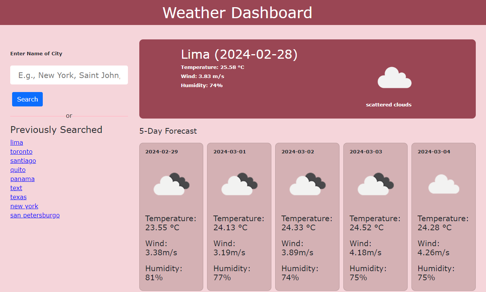

# Weather App (Pending to update)

## Description

This challenge was completed to demonstrate the use what I have learned of third-party APIs during week #5 of the UNB Coding Bootcamp.

User Story:
AS AN employee with a busy schedule;
I WANT to add important events to a daily planner;
SO THAT I can manage my time effectively

Screenshot of functional page:

Past Present Future

## Installation

To access the webpage, please follow this link in a web browser: https://msabao.github.io/bootcamp2023-Challenge5/

Repository link:
https://github.com/MSabaO/bootcamp2023-Challenge5

## Usage

What can I do?

- Daily planner to create a schedule
- Current day is displayed at the top of the calendar
- Time blocks for standard business hours of 9am to 5pm, plus additional under the banner for display purposes after hours
- Each time block is color-coded to indicate whether it is in the past (red), present(gray), or future(green)
- I can enter an event end click the save button for that time block
- Text for that event is saved in local storage even if I refresh the page
  Additional:
- I can clear the scheduler

## License

MIT License

Copyright (c) 2024 Maika Saba

Permission is hereby granted, free of charge, to any person obtaining a copy
of this software and associated documentation files (the "Software"), to deal
in the Software without restriction, including without limitation the rights
to use, copy, modify, merge, publish, distribute, sublicense, and/or sell
copies of the Software, and to permit persons to whom the Software is
furnished to do so, subject to the following conditions:

The above copyright notice and this permission notice shall be included in all
copies or substantial portions of the Software.

THE SOFTWARE IS PROVIDED "AS IS", WITHOUT WARRANTY OF ANY KIND, EXPRESS OR
IMPLIED, INCLUDING BUT NOT LIMITED TO THE WARRANTIES OF MERCHANTABILITY,
FITNESS FOR A PARTICULAR PURPOSE AND NONINFRINGEMENT. IN NO EVENT SHALL THE
AUTHORS OR COPYRIGHT HOLDERS BE LIABLE FOR ANY CLAIM, DAMAGES OR OTHER
LIABILITY, WHETHER IN AN ACTION OF CONTRACT, TORT OR OTHERWISE, ARISING FROM,
OUT OF OR IN CONNECTION WITH THE SOFTWARE OR THE USE OR OTHER DEALINGS IN THE
SOFTWARE.

---
